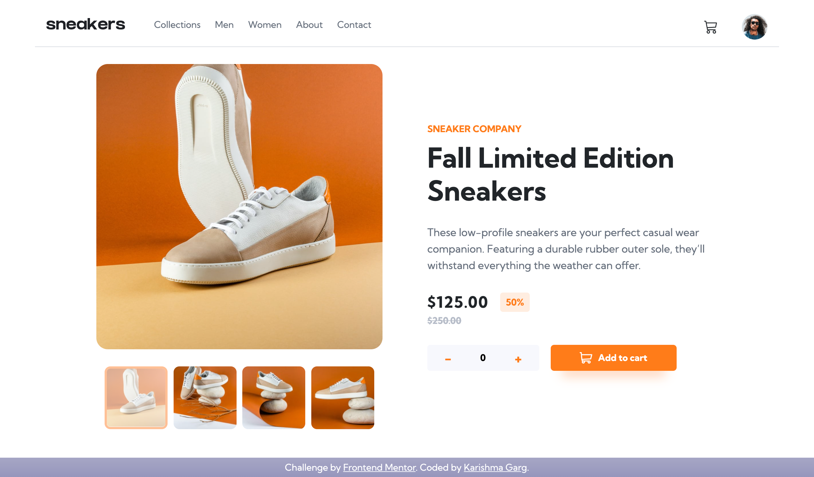

# Frontend Mentor - E-commerce product page solution

This is a solution to the [E-commerce product page challenge on Frontend Mentor](https://www.frontendmentor.io/challenges/ecommerce-product-page-UPsZ9MJp6). Frontend Mentor challenges help you improve your coding skills by building realistic projects.

## Table of contents

- [Overview](#overview)
  - [The challenge](#the-challenge)
  - [Screenshot](#screenshot)
  - [Links](#links)
- [My process](#my-process)
  - [Built with](#built-with)
- [Author](#author)

## Overview

### The challenge

Users should be able to:

- View the optimal layout for the site depending on their device's screen size
- See hover states for all interactive elements on the page
- Open a lightbox gallery by clicking on the large product image
- Switch the large product image by clicking on the small thumbnail images
- Add items to the cart
- View the cart and remove items from it

### Screenshot

### Links

- Solution URL: [https://github.com/Krrish105/ecom-product-page](https://github.com/Krrish105/ecom-product-page)
- Live Site URL: [http://Krrish105.github.io/ecom-product-page](http://Krrish105.github.io/ecom-product-page)

## My process

### Built with

- Semantic HTML5 markup
- CSS custom properties
- Flexbox
- CSS Grid
- Mobile-first workflow
- Bootstrap

## Author

- Frontend Mentor - [Krrish105](https://www.frontendmentor.io/profile/Krrish105)
- Twitter - [_karishma10](https://twitter.com/_karishma10)
- LinkedIn - [Karishma Garg](https://www.linkedin.com/in/karishma-garg-)
- CodePen - [Krrish105](https://codepen.io/krrish105)
